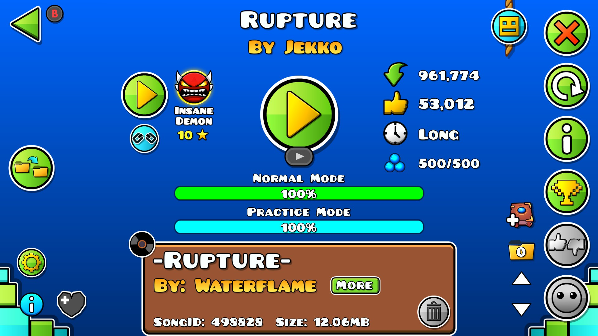
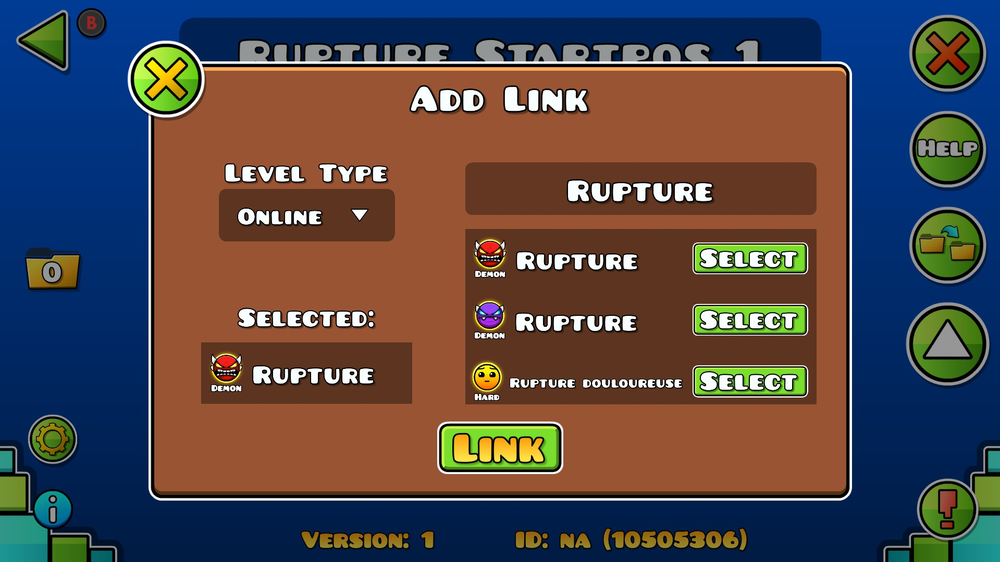

# LevelLink
Link two levels and access them with the click of a button

## Features:
- Create and break level links
- Browse editor and online with a custom interface
- Access links through level's 

## Why
This mod aims to be an intuitive and easy way to switch from practice copies to server copies.

## Contribute
If there are any incompatibilites (with UI or on load), or any crashes, please create an issue and I'll try to fix it as soon as possible!